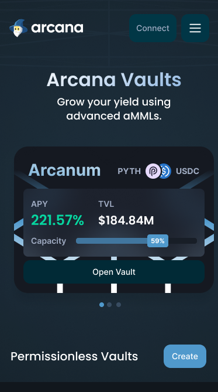
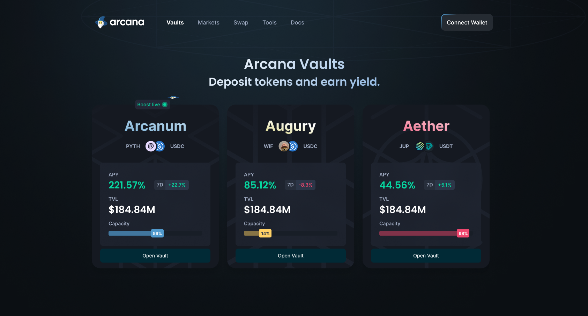

# 🧙‍♂️ Arcana Markets UI

The Arcana web app provides permissionless market making vaults designed to operate seamlessly on top of decentralized exchanges within the Solana ecosystem. Leveraging the power of Solana's high-speed blockchain, Arcana Markets aims to revolutionize liquidity provision, making it more accessible, efficient, and decentralized.

Responsive                     |  Desktop
:-------------------------:|:-------------------------:
  |  

## 👋 Introduction

Arcana Vaults aims to simplify and decentralize liquidity provision on Solana-based decentralized exchanges. By harnessing cutting-edge technology and an innovative approach, the project seeks to empower users and enhance DeFi accessibility.

## 🚀 Quickstart

To get started, follow these steps:

1. **Clone the repo:** Begin by cloning the repository using the command:

```bash
git clone git@github.com:arcana-markets/arcana-ui.git
```

2. **Install Dependencies:** Move into the directory and install the dependencies:

```bash
cd arcana-ui
npm install
```

3. **Run the app:**

```bash
npm run dev
```

You can start editing the page by modifying `app/page.tsx`. The page auto-updates as you edit the file.

This project uses [`next/font`](https://nextjs.org/docs/basic-features/font-optimization) to automatically optimize and load Inter, a custom Google Font.
 
### Structure

The below is an example structure for the project
 
```
├── public : publically hosted files
├── src : primary code folders and files 
│   ├── components : should house anything considered a resuable UI component
│   ├── contexts` : any context considered reusable and useuful to many compoennts that can be passed down through a component tree
│   ├── hooks` : any functions that let you 'hook' into react state or lifecycle features from function components
│   ├── models` : any data structure that may be reused throughout the project
│   ├── pages` : the pages that host meta data and the intended `View` for the page
│   ├── stores` : stores used in state management
│   ├── styles` : contain any global and reusable styles
│   ├── utils` : any other functionality considered reusable code that can be referenced
│   ├── views` : contains the actual views of the project that include the main content and components within
style, package, configuration, and other project files

```
## Key Features

- **Permissionless Participation:** Enables a true DeFi experience by allowing anyone to participate without needing permissions.
- **Decentralized Exchanges Compatibility:** Seamlessly works with various Solana DEXs, broadening its applicability.
- **High Performance and Security:** Utilizes the Rust programming language and the Anchor framework to ensure robust, secure operations.


# 🏦 Token Vaults Program

The Token Vaults program is a crucial component of our ecosystem, enabling secure and efficient token storage and transactions. For detailed information, implementation details, and to contribute, please visit the Arcana Vaults repository.

<a href="https://github.com/arcana-markets/arcana-vaults">
  
</a>

### Deployed Versions

| Tag  | Network | Program ID                                  |
| ---- | ------- | ------------------------------------------- |
| v0.1 | Devnet  | `FVbmcn58GVgYAGYqtQwVWwWrTDbSFqwXfCrErGEGo1mx` |

## Running the Project

To deploy and run tests ensuring everything is set up correctly, use the following command:

```bash
anchor build
anchor test
```

# 📈 Data & Infrastructure

Our ecosystem leverages cutting-edge data management and analytics to ensure seamless operations and performance enhancement. Below are the key components of our Data & Infrastructure layer:

### Arcana Data

The **Arcana Data APIs** act as a gateway to the Arcana ecosystem, enabling seamless interactions between developers, applications, and our extensive data layers. These APIs offer structured access to datasets and analytics, crucial for building robust and scalable DeFi applications.

<a href="https://github.com/arcana-markets/arcana-data">
  
</a>

### API Streams

  - `prod.arcana.markets/api/openbookv2/markets`
  - `prod.arcana.markets/api/phoenix/markets`

### Arcana Indexer

To complement our data repository, the **Arcana Data Indexer** plays a pivotal role in indexing on-chain DEX data. This ensures quick and reliable access to transaction data, enhancing our market-making strategies and operational efficiency.

<a href="https://github.com/arcana-markets/arcana-indexer">
  
</a>

## Architecture

Provides an overview of Arcana Vaults' system architecture, detailing its components, their interactions, and how the Solana blockchain plays a crucial role in its functionality.

# License

Arcana Vaults is licensed under the MIT License. For more information, see the LICENSE file in the project repository.

# Acknowledgments

Special thanks to the Solana community, contributors to the Anchor framework, and all the developers and enthusiasts supporting decentralized finance.

